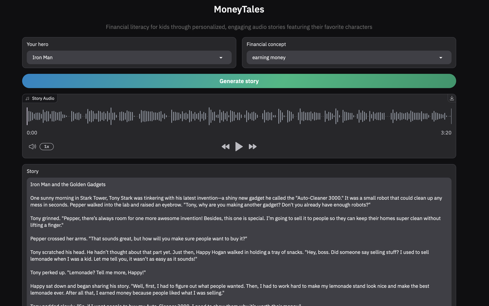

# MoneyTales


**MoneyTales** - engaging platform designed to teach financial literacy to kids through personalized audio stories featuring their favorite characters. 

The application generates stories and audio content based on selected heroes and financial concepts.

## Features

- Generate personalized stories based on selected heroes and financial concepts using Qwen LLM
- Convert stories to audio using ElevenLabs API
- Store and manage files using Alibaba Cloud OSS
- User-friendly interface built with Gradio
- Automatically generate RSS feed with created stories and upload them to Spotify (see my podcast [here](https://open.spotify.com/show/42gkfdwD7XHxyevMzI9xwx?si=9eda5ffd5a774bbe))



## Installation

1. **Clone the repository:**
   ```bash
   git clone https://github.com/VladKha/money_tales.git
   cd money_tales
   ```

2. **Set up the Python venv (use Python 3.11):**
   ```bash
   make setup
   ```

3. **Install the required packages:**
   ```bash
   make install_requirements
   ```

## Environment Variables

Create a `.env` file in the root directory from `.env.example` file 
and add all required environment variables for Alibaba Cloud services and ElevenLabs API.

## How to Run

To start the Gradio UI, run the following command:

```bash
make run_ui
```

This will launch the application in your default web browser.

## Technologies Used

- **Python**
- **Gradio**: UI
- **Alibaba Cloud**: Qwen LLM and generated files storage
- **ElevenLabs API**: text-to-speech conversion
- **dotenv**: managing environment variables
- **tenacity**: retrying failed requests
- **RSS**: generating RSS feed for Spotify
- **Spotify**: platform for distribution of results via generated RSS feed
